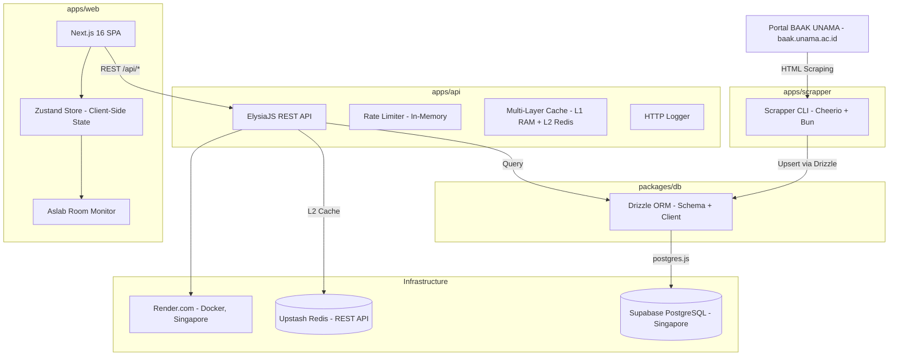
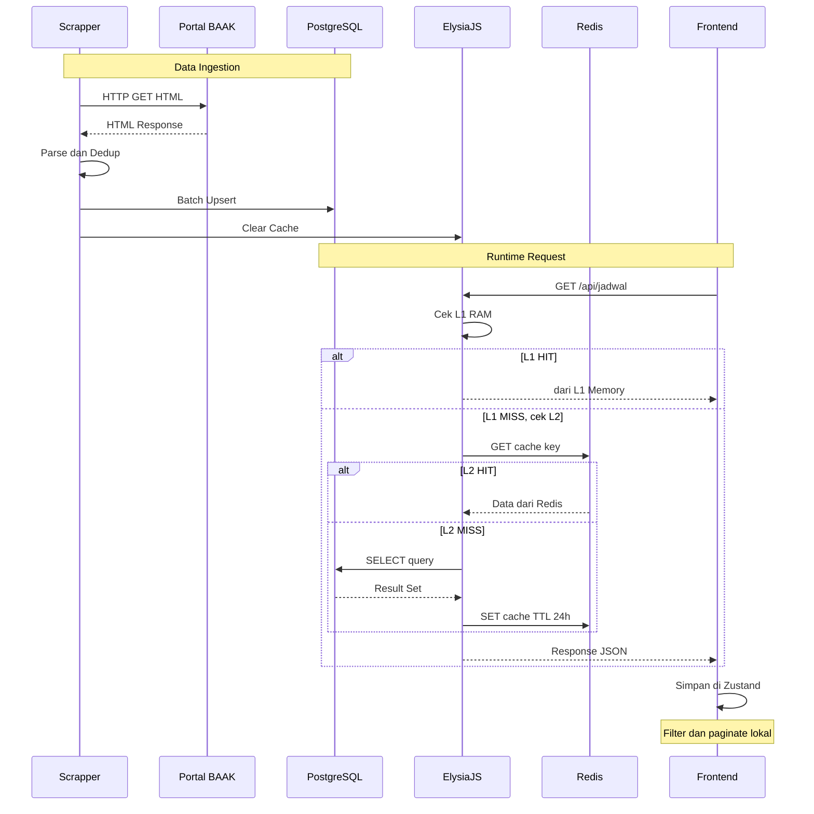

# Jadwal Kuliah UNAMA — Technical Overview

> **Versi Dokumen:** 1.0.0  
> **Terakhir Diperbarui:** 23 September 2026  
> **Audience:** Stakeholder, Enterprise Architect, Developer Baru

---

## 1. Executive Summary

**Jadwal Kuliah UNAMA** adalah sistem informasi jadwal perkuliahan dan praktikum laboratorium untuk Universitas Dinamika Bangsa (UNAMA). Sistem ini mengotomasi proses pengambilan data jadwal dari portal akademik BAAK UNAMA, menyimpannya ke database terkelola, dan menyajikannya melalui dashboard web interaktif yang dapat diakses oleh mahasiswa, dosen, dan asisten laboratorium (Aslab).

Masalah utama yang diselesaikan adalah **keterbatasan portal BAAK** yang tidak menyediakan fitur pencarian lanjut, filter multi-kriteria, atau monitoring ketersediaan ruang laboratorium secara real-time. Sistem ini memberikan nilai tambah berupa: dashboard responsif dengan filter instan tanpa *round-trip* jaringan, panel monitoring khusus Aslab untuk memantau status penggunaan laboratorium secara *real-time*, serta arsitektur *multi-layer caching* yang meminimalkan beban database dan menjaga performa tetap konsisten meskipun data mencapai 11.000+ entri jadwal.

---

## 2. Core Architecture & Component Overview

### 2.1. Gambaran Umum Arsitektur

Sistem dibangun sebagai **monorepo** dengan arsitektur **3-tier** (Data Ingestion → Backend API → Frontend Dashboard). Seluruh *runtime* berjalan di atas **Bun** untuk performa dan developer experience yang optimal.



### 2.2. Komponen Utama

| Komponen | Package Name | Tanggung Jawab |
| :--- | :--- | :--- |
| **Web Dashboard** | `@jadwal/web` | Frontend Next.js 16 dengan React 19. Menyajikan UI dashboard jadwal, filter, pencarian, dan panel Aslab. |
| **REST API** | `@jadwal/api` | Backend ElysiaJS. Menyediakan endpoint CRUD jadwal, autentikasi Aslab, ringkasan statistik, dan cache management. |
| **Scrapper** | `@jadwal/scrapper` | CLI tool untuk *web scraping* halaman jadwal BAAK UNAMA menggunakan Cheerio, lalu sinkronisasi ke database. |
| **Database Package** | `@jadwal/db` | *Shared package* berisi koneksi database (postgres.js) dan schema Drizzle ORM. Digunakan oleh API dan Scrapper. |

---

## 3. Key Features & Capabilities

### 3.1. Portal Jadwal Publik (Mahasiswa & Dosen)

- **Dashboard interaktif** dengan statistik real-time (total jadwal, tatap muka, online, cancel).
- **Multi-filter instan** — tanggal, hari, kampus, ruangan, status, dan pencarian teks bebas. Semua filter diproses 100% di memori browser (*zero network round-trip* setelah *initial load*).
- **Dua mode tampilan** — *grid view* (card-based) dan *table view*.
- **Pagination** — klien-side pagination dengan limit konfigurabel (default 24 item/halaman).
- **Detail dialog** — modal pop-up dengan informasi lengkap jadwal dan opsi ekspor ke Google Calendar.
- **Dark mode** — mendukung tema sistem, terang, dan gelap melalui `next-themes`.
- **Date picker** — pemilih tanggal terintegrasi dengan format Indonesia (WIB).
- **Fallback data** — saat API backend tidak tersedia, frontend tetap berfungsi dengan data statis *hardcoded*.

### 3.2. Panel Asisten Laboratorium (Aslab)

- **Autentikasi berbasis secret code** — Aslab login dengan kode rahasia, mendapat session token (Base64).
- **Room Monitor real-time** — menampilkan status setiap laboratorium UNAMA (12 lab) apakah sedang terpakai, kosong, atau ada kelas daring.
- **Progress indicator** — persentase kemajuan sesi perkuliahan yang sedang berlangsung.
- **Gap analysis** — perhitungan otomatis jeda waktu kosong antar kelas per ruangan lab, termasuk klasifikasi jeda (sebelum kelas, antar kelas, setelah kelas, seharian kosong).
- **Mapping petugas jaga** — referensi nama Aslab penanggung jawab per ruangan laboratorium.
- **Operasional per kampus** — logika jam tutup berbeda: Kampus Kobar (17:00 WIB), Kampus Thehok (dinamis, mengikuti sesi lab terakhir).

### 3.3. Data Ingestion & Scraping

- **Multi-page scraping** — otomatis mendeteksi total halaman dan melakukan iterasi hingga seluruh data tersinkronisasi.
- **Retry mechanism** — 3x retry dengan *exponential backoff* (1s, 2s, 3s) per halaman.
- **Team teaching merger** — menggabungkan baris duplikat untuk kelas dengan >1 dosen (*team teaching*) secara in-memory.
- **Upsert strategy** — `INSERT ... ON CONFLICT DO UPDATE` menggunakan *unique composite index* untuk mencegah duplikasi.
- **Fallback row-by-row** — jika batch insert gagal, otomatis *retry* per-baris agar data yang valid tetap tersimpan.
- **Auto cache invalidation** — setelah sync selesai, otomatis membersihkan cache Redis.
- **Mode operasi fleksibel** — `--test` (preview), `--sync` (full sync), `--clean` (hapus data lama + sync ulang), `--labor` (khusus laboratorium), `--limit N` (batasi jumlah halaman).

### 3.4. Caching & Performance

- **Multi-layer cache (L1 + L2)**:
  - **L1 (In-Process RAM)** — TTL 1 jam. Latensi ~0.01ms.
  - **L2 (Upstash Redis)** — TTL 24 jam. Latensi ~50-100ms.
- **Single-flight mutex** — mencegah *cache stampede*. Ratusan request simultan hanya menghasilkan 1 query ke Redis.
- **Rate limiting** — sliding-window in-memory rate limiter:
  - API global: 30 request/menit per IP.
  - Auth endpoint: 10 request/menit per IP (anti brute-force).
- **Client-side caching** — seluruh database (~11.000 jadwal) di-fetch 1x lalu disimpan di Zustand store. Semua operasi filter, sort, dan paginate dilakukan di browser.

---

## 4. Integration & Data Flow

### 4.1. Diagram Alur Data



### 4.2. Protokol & Integrasi

| Integrasi | Protokol | Detail |
| :--- | :--- | :--- |
| Frontend → API | **REST over HTTP** | Endpoint JSON di bawah `/api/*`. Timeout 10 detik. |
| API → Supabase | **PostgreSQL wire protocol** | Koneksi via `postgres.js`. Transaction pooler (port 6543) didukung dengan disable prepared statements. |
| API → Upstash Redis | **HTTPS REST API** | Menggunakan `@upstash/redis` SDK. Tidak memerlukan koneksi TCP persistent. |
| Scrapper → BAAK | **HTTP GET** | *Web scraping* terhadap halaman HTML publik BAAK. User-Agent browser digunakan untuk menghindari pemblokiran. |
| Frontend → API (Auth) | **Bearer Token** | Token Base64 sederhana (`aslab:<timestamp>`). Dikirim via header `Authorization`. |
| CORS | **Open Origin** | API mengizinkan semua origin (`origin: true`) untuk kemudahan pengembangan. |
| Type Safety | **Eden Treaty (opsional)** | ElysiaJS mengekspor `App` type agar frontend dapat mengonsumsi API dengan TypeScript autocomplete penuh. |

---

## 5. Technology Stack & Rationale

### 5.1. Runtime & Bahasa

| Teknologi | Versi | Alasan Pemilihan |
| :--- | :--- | :--- |
| **Bun** | 1.4+ | All-in-one runtime JavaScript/TypeScript. Menggantikan Node.js + npm/yarn. Menawarkan performa startup dan HTTP yang jauh lebih cepat, serta built-in TypeScript transpiler. |
| **TypeScript** | 5.8+ | Type safety end-to-end di seluruh monorepo (scrapper, API, frontend, schema). |

### 5.2. Frontend

| Teknologi | Versi | Alasan Pemilihan |
| :--- | :--- | :--- |
| **Next.js** | 16.3.5 | Framework React full-stack. Digunakan untuk SSR metadata dan routing berbasis file system. |
| **React** | 19.2.8 | Library UI komponen. Versi terbaru dengan fitur concurrent rendering. |
| **Zustand** | 5.0.15 | *State management* ringan. Menghindari boilerplate Redux. Memungkinkan menyimpan seluruh dataset di memori klien dengan selector yang efisien. |
| **Tailwind CSS** | 4.x | Utility-first CSS framework. Mempercepat styling tanpa menulis file CSS terpisah. |
| **shadcn/ui** | 4.21 | Komponen UI berbasis Radix/Base UI yang dapat dikustomisasi. Tidak menambah bundle sebagai dependency — kode di-copy langsung. |
| **date-fns** | 4.4 | Library manipulasi tanggal. Mendukung locale Indonesia untuk format tanggal (`dd MMMM yyyy`). |
| **Lucide React** | 1.45 | Library ikon SVG modern dan ringan sebagai pengganti FontAwesome/Heroicons. |
| **Recharts** | 3.8 | Library charting berbasis React dan D3 untuk visualisasi statistik. |

### 5.3. Backend

| Teknologi | Versi | Alasan Pemilihan |
| :--- | :--- | :--- |
| **ElysiaJS** | 1.2.25 | Framework HTTP yang dioptimasi untuk Bun. End-to-end type safety, validasi schema otomatis (TypeBox), dan performa ~3x lebih cepat dari Express. |
| **Drizzle ORM** | 0.40 | ORM TypeScript-first yang ringan. SQL-like query builder tanpa abstraksi berlebihan. Mendukung `push` migration dan Drizzle Studio untuk inspeksi data. |
| **postgres.js** | 3.4.5 | PostgreSQL client untuk JavaScript. Mendukung connection pooling dan prepared statements. |
| **@upstash/redis** | 1.38.4 | Redis client berbasis HTTP REST. Ideal untuk serverless/edge karena tidak memerlukan koneksi TCP persistent. |

### 5.4. Data Ingestion

| Teknologi | Versi | Alasan Pemilihan |
| :--- | :--- | :--- |
| **Cheerio** | 1.0 | Library parsing HTML yang ringan dan cepat. Tidak memerlukan browser headless (Puppeteer/Playwright) karena data BAAK tersedia di HTML statis (server-rendered). |

### 5.5. Database & Infrastructure

| Teknologi | Region | Alasan Pemilihan |
| :--- | :--- | :--- |
| **Supabase (PostgreSQL)** | ap-southeast-1 (Singapore) | Managed PostgreSQL dengan connection pooler (Supavisor). Dipilih karena kedekatan region ke Indonesia dan tier gratis yang memadai. |
| **Upstash Redis** | — | Serverless Redis dengan REST API. TTL-based caching tanpa perlu mengelola instance Redis sendiri. |
| **Render.com** | Singapore | PaaS untuk deployment Docker container. Dipilih karena mendukung free tier, region Singapore, dan auto-deploy dari Git. |
| **Docker** | Alpine-based | Containerisasi menggunakan `oven/bun:1-alpine` untuk ukuran image minimal. |

### 5.6. Monorepo Structure

```
jadwal-kuliah-unama/
├── apps/
│   ├── api/            → @jadwal/api (ElysiaJS backend)
│   ├── web/            → @jadwal/web (Next.js frontend)
│   └── scrapper/       → @jadwal/scrapper (CLI scraping tool)
├── packages/
│   └── db/             → @jadwal/db (Drizzle schema + DB client)
├── Dockerfile          → Production container (API only)
├── render.yaml         → Render.com deployment manifest
└── package.json        → Bun workspace root
```

---

## 6. Database Schema

Sistem menggunakan satu tabel utama `jadwal_lab_2025_genap` di PostgreSQL:

| Kolom | Tipe | Constraint | Deskripsi |
| :--- | :--- | :--- | :--- |
| `id` | `serial` | **PK**, auto-increment | Identifier unik |
| `hari` | `varchar(20)` | `NOT NULL` | Nama hari (Senin–Sabtu) |
| `tanggal` | `varchar(50)` | `NOT NULL` | Tanggal lengkap (e.g. "13 April 2026") |
| `waktu_mulai` | `varchar(10)` | `NOT NULL` | Jam mulai (format HH:mm) |
| `dosen` | `varchar(150)` | `NOT NULL` | Nama dosen (team teaching dipisah " / ") |
| `kode_kelas` | `varchar(50)` | `NOT NULL` | Kode kelas (e.g. "01PS2") |
| `mata_kuliah` | `varchar(200)` | `NOT NULL` | Nama mata kuliah |
| `kampus` | `varchar(100)` | `NOT NULL` | Nama kampus (Thehok / Kobar) |
| `ruangan` | `varchar(100)` | `NOT NULL` | Nama ruangan atau laboratorium |
| `status` | `varchar(50)` | `NOT NULL` | Status kelas (OnSchedule TM/OL, Cancel) |
| `created_at` | `timestamp` | `NOT NULL`, default `now()` | Waktu record dibuat |
| `updated_at` | `timestamp` | `NOT NULL`, default `now()` | Waktu record terakhir diperbarui |

**Unique Composite Index:** `(tanggal, waktu_mulai, kode_kelas, mata_kuliah, ruangan)` — memastikan tidak ada duplikasi jadwal dan mendukung strategi `ON CONFLICT DO UPDATE` saat scraping.

---

## 7. API Endpoints Reference

| # | Method | Path | Deskripsi | Auth |
| :--- | :--- | :--- | :--- | :--- |
| 1 | `GET` | `/` | Health check & server status | — |
| 2 | `GET` | `/api/jadwal` | Daftar jadwal dengan multi-filter & pagination | — |
| 3 | `GET` | `/api/jadwal/summary` | Ringkasan statistik (total, TM, OL, cancel, kampus, ruangan) | — |
| 4 | `GET` | `/api/jadwal/:id` | Detail satu jadwal berdasarkan ID | — |
| 5 | `POST` | `/api/auth/login` | Login Aslab dengan secret code | — |
| 6 | `GET` | `/api/auth/verify` | Verifikasi token sesi Aslab | Bearer |
| 7 | `POST` | `/api/cache/clear` | Invalidasi cache L1 RAM + L2 Redis | — |

### Filter Parameters (`GET /api/jadwal`)

| Parameter | Tipe | Deskripsi |
| :--- | :--- | :--- |
| `all` | `string` | Set `"true"` untuk mengambil seluruh data tanpa limit/offset |
| `search` | `string` | Pencarian teks bebas (mata kuliah, dosen, kode kelas, ruangan) |
| `hari` | `string` | Filter hari (Senin, Selasa, dst.) |
| `tanggal` | `string` | Filter tanggal (e.g. "13 April 2026") |
| `kampus` | `string` | Filter kampus |
| `ruangan` / `ruangLabor` | `string` | Filter ruangan (case-insensitive substring) |
| `dosen` | `string` | Filter dosen (case-insensitive substring) |
| `mataKuliah` | `string` | Filter mata kuliah (case-insensitive substring) |
| `kodeKelas` | `string` | Filter kode kelas |
| `status` | `string` | Filter status perkuliahan |
| `limit` | `number` | Jumlah data per halaman (1–500, default: 50) |
| `offset` | `number` | Offset untuk pagination (default: 0) |

---

## 8. Current Status & Roadmap

### 8.1. Status Saat Ini

| Aspek | Status | Catatan |
| :--- | :--- | :--- |
| Scraping BAAK | ✅ Operasional | ~11.000 jadwal semester genap 2025 berhasil disinkronkan |
| Backend API | ✅ Operasional | Deploy di Render.com (free tier, region Singapore) |
| Frontend Dashboard | ✅ Operasional | Siap akses publik |
| Panel Aslab | ✅ Operasional | Room monitoring + gap analysis aktif |
| Caching (Redis) | ✅ Operasional | Multi-layer L1 + L2 aktif |
| Dark Mode | ✅ Operasional | Mendukung system, light, dan dark |
| Mobile Responsive | ✅ Operasional | Layout responsif untuk mobile/tablet/desktop |

### 8.2. Batasan Sistem (Known Limitations)

- **Autentikasi Aslab** — menggunakan token Base64 sederhana tanpa expiration atau JWT. Tidak cocok untuk produksi dengan banyak user Aslab.
- **Scraping manual** — proses scraping harus dijalankan secara manual via CLI. Belum ada cron job atau scheduler otomatis.
- **Cache invalidation** — endpoint `/api/cache/clear` tidak memerlukan autentikasi. Siapapun dapat menghapus cache.
- **CORS open** — `origin: true` mengizinkan semua domain. Perlu dikunci untuk domain produksi.
- **Single table** — seluruh data jadwal (kelas teori + lab) tersimpan dalam 1 tabel. Belum ada normalisasi untuk entitas dosen, ruangan, atau mata kuliah.
- **Durasi kelas hardcoded** — estimasi 100 menit per sesi digunakan secara universal. Tidak memperhitungkan kelas dengan durasi berbeda (e.g. 50 menit atau 150 menit).
- **Free tier infrastructure** — Render.com free tier memiliki cold start dan auto-sleep setelah 15 menit tidak aktif.

### 8.3. Rekomendasi Pengembangan (Future Roadmap)

| Prioritas | Rekomendasi | Alasan |
| :--- | :--- | :--- |
| 🔴 Tinggi | Migrasi autentikasi ke JWT dengan refresh token | Keamanan sesi Aslab |
| 🔴 Tinggi | Proteksi endpoint `/api/cache/clear` dengan auth | Mencegah abuse invalidasi cache |
| 🟡 Sedang | Cron scheduler untuk auto-scraping (harian/mingguan) | Menghilangkan ketergantungan manual |
| 🟡 Sedang | Restrict CORS ke domain produksi spesifik | Keamanan API |
| 🟡 Sedang | Normalisasi tabel (dosen, ruangan, mata kuliah) | Skalabilitas data |
| 🟢 Rendah | Notifikasi perubahan jadwal (email/push) | Pengalaman pengguna |
| 🟢 Rendah | PWA / Service Worker untuk offline access | Kemampuan offline |
| 🟢 Rendah | Integrasi Eden Treaty untuk type-safe API consumption | Developer experience |

---

## 9. Asumsi & Rekomendasi

> Bagian ini mendokumentasikan informasi yang **tidak secara eksplisit** tersedia dalam kode sumber, namun dapat disimpulkan atau perlu dikonfirmasi.

### Asumsi

1. **Durasi perkuliahan** diasumsikan 100 menit per sesi berdasarkan standar 2 SKS. Kode sumber menggunakan *hardcoded value* ini di seluruh kalkulasi gap dan progress.
2. **Semester aktif** — nama tabel `jadwal_lab_2025_genap` mengindikasikan data semester genap 2025/2026. Diasumsikan tabel baru akan dibuat untuk semester berikutnya (belum ada mekanisme migrasi otomatis).
3. **Deployment frontend** — Dockerfile hanya men-deploy API backend. Frontend Next.js diasumsikan di-deploy secara terpisah (kemungkinan via Vercel, berdasarkan `web/README.md` yang menyebutkan "Deploy on Vercel").
4. **Upstash Redis** — kredensial (`UPSTASH_REDIS_REST_URL` / `UPSTASH_REDIS_REST_TOKEN`) tidak ada di `.env.example`. Jika tidak dikonfigurasi, sistem tetap berfungsi tanpa caching L2 (degradasi *graceful*).

### Rekomendasi Arsitektural

1. **Environment variable management** — pertimbangkan menambahkan `UPSTASH_REDIS_REST_URL`, `UPSTASH_REDIS_REST_TOKEN`, dan `NEXT_PUBLIC_API_URL` ke `.env.example` agar developer baru dapat mengkonfigurasi semua layanan.
2. **Health check endpoint** — tambahkan pengecekan konektivitas database dan Redis di endpoint health check (`/`) agar monitoring infrastructure lebih informatif.
3. **API versioning** — pertimbangkan *path-based versioning* (`/api/v1/jadwal`) untuk mendukung evolusi API tanpa *breaking changes*.

---

*Dokumen ini dihasilkan berdasarkan analisis kode sumber commit `38de468b` dari repository `jadwal-kuliah-unama`.*
