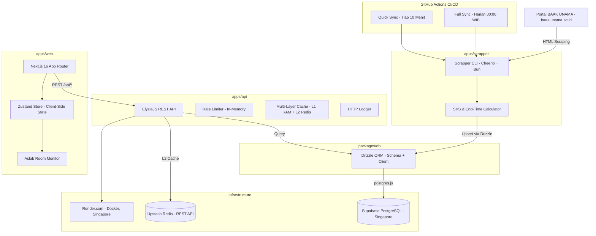
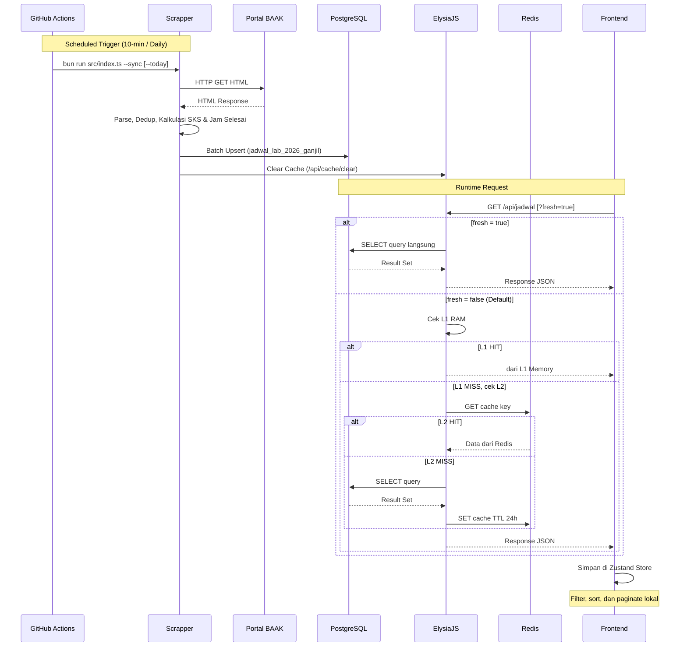

# Jadwal Kuliah UNAMA — Technical Overview

> **Versi Dokumen:** 1.1.0  
> **Terakhir Diperbarui:** 28 September 2026  
> **Audience:** Stakeholder, Enterprise Architect, Developer Baru

---

## 1. Executive Summary

**Jadwal Kuliah UNAMA** adalah sistem informasi jadwal perkuliahan dan praktikum laboratorium untuk Universitas Dinamika Bangsa (UNAMA). Sistem ini mengotomasi proses pengambilan data jadwal dari portal akademik BAAK UNAMA, menyimpannya ke database terkelola PostgreSQL (Supabase), dan menyajikannya melalui dashboard web interaktif untuk mahasiswa, dosen, dan asisten laboratorium (Aslab).

Masalah utama yang diselesaikan adalah **keterbatasan portal BAAK** yang tidak menyediakan pencarian cepat, filter multi-kriteria, atau monitoring ketersediaan ruang laboratorium secara real-time. Sistem ini memberikan solusi melalui:
- **Sinkronisasi otomatis terjadwal**: Workflow GitHub Actions yang menjalankan quick sync jadwal harian tiap 10 menit dan full sync harian tiap tengah malam.
- **Kalkulasi SKS & durasi dinamis**: Ekstraksi dan kalkulasi SKS mata kuliah untuk menghasilkan rentang jam perkuliahan presisi (`waktu_mulai` s.d. `waktu_selesai` berbasis `SKS * 50 menit`).
- **Dashboard responsif**: Filter instan berbasis *client-side in-memory* tanpa latensi jaringan setelah data dimuat.
- **Room Monitor Aslab**: Pemantauan status 12 laboratorium secara langsung, indikator kemajuan kelas, dan analisis jeda kekosongan ruangan (*gap analysis*).
- **Multi-layer caching**: Kombinasi L1 (RAM) dan L2 (Upstash Redis) dengan dukungan bypass cache (`?fresh=true`) bila diperlukan.

---

## 2. Core Architecture & Component Overview

### 2.1. Gambaran Umum Arsitektur

Sistem dibangun sebagai **monorepo** dengan arsitektur **3-tier** (Data Ingestion → Backend API → Frontend Dashboard) menggunakan runtime **Bun**.


```mermaid
flowchart TD
    BAAK["Portal BAAK UNAMA - baak.unama.ac.id"]

    subgraph GHA ["GitHub Actions CI/CD"]
        CRON1["Quick Sync - Tiap 10 Menit"]
        CRON2["Full Sync - Harian 00:00 WIB"]
    end

    subgraph SCRAPPER ["apps/scrapper"]
        SCR["Scrapper CLI - Cheerio + Bun"]
        SKS["SKS & End-Time Calculator"]
    end

    subgraph DATABASE ["packages/db"]
        DRZ["Drizzle ORM - Schema + Client"]
    end

    subgraph BACKEND ["apps/api"]
        API["ElysiaJS REST API"]
        RL["Rate Limiter - In-Memory"]
        CACHE["Multi-Layer Cache - L1 RAM + L2 Redis"]
        LOG["HTTP Logger"]
    end

    subgraph FRONTEND ["apps/web"]
        NEXT["Next.js 16 App Router"]
        ZUS["Zustand Store - Client-Side State"]
        ASLAB["Aslab Room Monitor"]
    end

    subgraph INFRA ["Infrastructure"]
        SUPA[("Supabase PostgreSQL - Singapore")]
        REDIS[("Upstash Redis - REST API")]
        RENDER["Render.com - Docker, Singapore"]
    end

    BAAK -- "HTML Scraping" --> SCR
    CRON1 --> SCR
    CRON2 --> SCR
    SCR --> SKS
    SKS -- "Upsert via Drizzle" --> DRZ
    DRZ -- "postgres.js" --> SUPA
    API -- "Query" --> DRZ
    API -- "L2 Cache" --> REDIS
    NEXT -- "REST /api/*" --> API
    NEXT --> ZUS
    ZUS --> ASLAB
    API --> RENDER
```

### 2.2. Komponen Utama

| Komponen | Package Name | Tanggung Jawab |
| :--- | :--- | :--- |
| **Web Dashboard** | `@jadwal/web` | Frontend Next.js 16 dengan React 19. Menyajikan UI dashboard jadwal, SKS badges, filter, pencarian, dan panel monitoring Aslab. |
| **REST API** | `@jadwal/api` | Backend ElysiaJS. Menyediakan endpoint CRUD jadwal, autentikasi Aslab, ringkasan statistik, bypass cache (`fresh`), dan cache management. |
| **Scrapper** | `@jadwal/scrapper` | CLI & background automation tool untuk scraping BAAK UNAMA menggunakan Cheerio, kalkulasi SKS dan jam selesai, serta sinkronisasi ke database. |
| **Database Package** | `@jadwal/db` | *Shared package* berisi koneksi database (postgres.js) dan schema Drizzle ORM (tabel jadwal aktif, arsip, master mata kuliah, dan kurikulum). |

---

## 3. Key Features & Capabilities

### 3.1. Portal Jadwal Publik (Mahasiswa & Dosen)

- **Dashboard interaktif** dengan statistik real-time (total jadwal, tatap muka, online, cancel).
- **Badge SKS & durasi presisi** — setiap entri menampilkan badge jumlah SKS (misal: "2 SKS", "3 SKS") dan rentang jam kuliah lengkap (`waktu_mulai` - `waktu_selesai`), dilengkapi indikator visual saat sesi kelas sedang berlangsung (*live*).
- **Multi-filter instan** — tanggal, hari, kampus, ruangan, status, dan pencarian teks bebas. Semua filter diproses 100% di memori browser (*zero network round-trip* setelah *initial load*).
- **Dua mode tampilan** — *grid view* (card-based) dan *table view*.
- **Pagination** — klien-side pagination dengan limit konfigurabel (default 24 item/halaman).
- **Detail dialog** — modal pop-up dengan informasi lengkap jadwal, SKS, waktu selesai, dan opsi ekspor ke Google Calendar.
- **Dark mode** — mendukung tema sistem, terang, dan gelap melalui `next-themes`.
- **Date picker** — pemilih tanggal terintegrasi dengan format Indonesia (WIB).
- **Fallback data** — saat API backend tidak tersedia, frontend tetap berfungsi dengan data statis *hardcoded*.

### 3.2. Panel Asisten Laboratorium (Aslab)

- **Autentikasi berbasis secret code** — Aslab login dengan kode rahasia, mendapat session token (Base64).
- **Room Monitor real-time** — menampilkan status setiap laboratorium UNAMA (12 lab) apakah sedang terpakai, kosong, atau ada kelas daring.
- **Progress indicator dinamis** — persentase kemajuan sesi perkuliahan dihitung berdasarkan durasi aktual SKS (`SKS * 50 menit`, dengan fallback 100 menit).
- **Gap analysis akurat** — perhitungan otomatis jeda waktu kosong antar kelas per ruangan lab dengan mempertimbangkan jam selesai tiap mata kuliah, termasuk klasifikasi jeda (sebelum kelas, antar kelas, setelah kelas, seharian kosong).
- **Mapping petugas jaga** — referensi nama Aslab penanggung jawab per ruangan laboratorium.
- **Operasional per kampus** — logika jam tutup berbeda: Kampus Kobar (17:00 WIB), Kampus Thehok (dinamis, mengikuti sesi lab terakhir).

### 3.3. Data Ingestion & Scraping

- **Otomasi GitHub Actions**:
  - **Quick Sync Hari Ini (`scrape-today.yml`)**: Berjalan otomatis tiap 10 menit (`*/10 * * * *`) untuk memperbarui jadwal dan status kelas hari ini secara cepat.
  - **Full Sync Harian (`scrape-sync.yml`)**: Berjalan tiap tengah malam pukul 00:00 WIB / 17:00 UTC (`0 17 * * *`) untuk menyinkronkan seluruh jadwal satu semester.
- **Kalkulasi SKS & Jam Selesai** — scraper mengekstraksi atau memetakan bobot SKS mata kuliah dan secara otomatis menghitung `waktu_selesai = waktu_mulai + SKS * 50 menit`.
- **Multi-page scraping** — otomatis mendeteksi total halaman dan melakukan iterasi hingga seluruh data tersinkronisasi.
- **Retry mechanism** — 3x retry dengan *exponential backoff* (1s, 2s, 3s) per halaman.
- **Team teaching merger** — menggabungkan baris duplikat untuk kelas dengan >1 dosen (*team teaching*) secara in-memory.
- **Upsert strategy** — `INSERT ... ON CONFLICT DO UPDATE` menggunakan *unique composite index* untuk mencegah duplikasi.
- **Fallback row-by-row** — jika batch insert gagal, otomatis *retry* per-baris agar data yang valid tetap tersimpan.
- **Auto cache invalidation** — setelah sync selesai, otomatis membersihkan cache Redis.
- **Mode operasi CLI fleksibel** — `--test` (preview), `--sync` (full sync), `--today` (hanya hari ini), `--clean` (hapus data lama + sync ulang), `--labor` (khusus laboratorium), `--limit N` (batasi jumlah halaman).

### 3.4. Caching & Performance

- **Multi-layer cache (L1 + L2)**:
  - **L1 (In-Process RAM)** — TTL 1 jam. Latensi ~0.01ms.
  - **L2 (Upstash Redis)** — TTL 24 jam. Latensi ~50-100ms.
- **Bypass cache (`fresh=true`)** — parameter opsional `?fresh=true` pada endpoint `/api/jadwal` untuk memaksa query langsung ke PostgreSQL saat butuh data paling mutakhir.
- **Single-flight mutex** — mencegah *cache stampede*. Ratusan request simultan hanya menghasilkan 1 query ke Redis.
- **Rate limiting** — sliding-window in-memory rate limiter:
  - API global: 30 request/menit per IP.
  - Auth endpoint: 10 request/menit per IP (anti brute-force).
- **Client-side caching** — seluruh database jadwal di-fetch 1x lalu disimpan di Zustand store. Semua operasi filter, sort, dan paginate dilakukan di browser.

---

## 4. Integration & Data Flow

### 4.1. Diagram Alur Data


```mermaid
sequenceDiagram
    participant GHA as GitHub Actions
    participant SCR as Scrapper
    participant BAAK as Portal BAAK
    participant DB as PostgreSQL
    participant API as ElysiaJS
    participant REDIS as Redis
    participant WEB as Frontend

    Note over GHA,SCR: Scheduled Trigger (10-min / Daily)
    GHA->>SCR: bun run src/index.ts --sync [--today]
    SCR->>BAAK: HTTP GET HTML
    BAAK-->>SCR: HTML Response
    SCR->>SCR: Parse, Dedup, Kalkulasi SKS & Jam Selesai
    SCR->>DB: Batch Upsert (jadwal_lab_2026_ganjil)
    SCR->>API: Clear Cache (/api/cache/clear)

    Note over WEB,DB: Runtime Request
    WEB->>API: GET /api/jadwal [?fresh=true]
    
    alt fresh = true
        API->>DB: SELECT query langsung
        DB-->>API: Result Set
        API-->>WEB: Response JSON
    else fresh = false (Default)
        API->>API: Cek L1 RAM
        alt L1 HIT
            API-->>WEB: dari L1 Memory
        else L1 MISS, cek L2
            API->>REDIS: GET cache key
            alt L2 HIT
                REDIS-->>API: Data dari Redis
            else L2 MISS
                API->>DB: SELECT query
                DB-->>API: Result Set
                API->>REDIS: SET cache TTL 24h
            end
            API-->>WEB: Response JSON
        end
    end

    WEB->>WEB: Simpan di Zustand Store
    Note over WEB: Filter, sort, dan paginate lokal
```

### 4.2. Protokol & Integrasi

| Integrasi | Protokol | Detail |
| :--- | :--- | :--- |
| Frontend → API | **REST over HTTP** | Endpoint JSON di bawah `/api/*`. Timeout 10 detik. |
| API → Supabase | **PostgreSQL wire protocol** | Koneksi via `postgres.js`. Transaction pooler (port 6543) didukung dengan disable prepared statements. |
| API → Upstash Redis | **HTTPS REST API** | Menggunakan `@upstash/redis` SDK. Tidak memerlukan koneksi TCP persistent. |
| Scrapper → BAAK | **HTTP GET** | *Web scraping* terhadap halaman HTML publik BAAK. User-Agent browser digunakan untuk menghindari pemblokiran. |
| GitHub Actions → Database | **PostgreSQL direct connection** | Worker mengeksekusi script scraper dengan kredensial database dari GitHub Secrets. |
| Frontend → API (Auth) | **Bearer Token** | Token Base64 sederhana (`aslab:<timestamp>`). Dikirim via header `Authorization`. |
| CORS | **Open Origin** | API mengizinkan semua origin (`origin: true`) untuk kemudahan pengembangan. |
| Type Safety | **Eden Treaty (opsional)** | ElysiaJS mengekspor `App` type agar frontend dapat mengonsumsi API dengan TypeScript autocomplete penuh. |

---

## 5. Technology Stack & Rationale

### 5.1. Runtime & Bahasa

| Teknologi | Versi | Alasan Pemilihan |
| :--- | :--- | :--- |
| **Bun** | 1.4+ | All-in-one runtime JavaScript/TypeScript. Menggantikan Node.js + npm/yarn. Menawarkan performa startup dan HTTP yang jauh lebih cepat, serta built-in TypeScript transpiler. |
| **TypeScript** | 7.0+ | Type safety end-to-end di seluruh monorepo (scrapper, API, frontend, schema). |

### 5.2. Frontend

| Teknologi | Versi | Alasan Pemilihan |
| :--- | :--- | :--- |
| **Next.js** | 16.3.6 | Framework React full-stack. Digunakan untuk SSR metadata dan routing berbasis file system (App Router). |
| **React** | 19.3.0 | Library UI komponen. Versi terbaru dengan fitur concurrent rendering. |
| **Zustand** | 5.0.15 | *State management* ringan. Menghindari boilerplate Redux. Memungkinkan menyimpan seluruh dataset di memori klien dengan selector yang efisien. |
| **Tailwind CSS** | 4.x | Utility-first CSS framework. Mempercepat styling tanpa menulis file CSS terpisah. |
| **shadcn/ui** | 4.21 | Komponen UI berbasis Radix/Base UI yang dapat dikustomisasi. Tidak menambah bundle sebagai dependency — kode di-copy langsung. |
| **date-fns** | 4.4 | Library manipulasi tanggal. Mendukung locale Indonesia untuk format tanggal (`dd MMMM yyyy`). |
| **Lucide React** | 1.48 | Library ikon SVG modern dan ringan sebagai pengganti FontAwesome/Heroicons. |
| **Recharts** | 3.10.1 | Library charting berbasis React dan D3 untuk visualisasi statistik. |

### 5.3. Backend

| Teknologi | Versi | Alasan Pemilihan |
| :--- | :--- | :--- |
| **ElysiaJS** | 1.4.30 | Framework HTTP yang dioptimasi untuk Bun. End-to-end type safety, validasi schema otomatis (TypeBox), dan performa ~3x lebih cepat dari Express. |
| **Drizzle ORM** | 0.45.3 | ORM TypeScript-first yang ringan. SQL-like query builder tanpa abstraksi berlebihan. Mendukung `push` migration dan Drizzle Studio untuk inspeksi data. |
| **postgres.js** | 3.4.9 | PostgreSQL client untuk JavaScript. Mendukung connection pooling dan prepared statements. |
| **@upstash/redis** | 1.39.0 | Redis client berbasis HTTP REST. Ideal untuk serverless/edge karena tidak memerlukan koneksi TCP persistent. |

### 5.4. Data Ingestion & Automation

| Teknologi | Versi | Alasan Pemilihan |
| :--- | :--- | :--- |
| **Cheerio** | 1.2.0 | Library parsing HTML yang ringan dan cepat. Tidak memerlukan browser headless (Puppeteer/Playwright) karena data BAAK tersedia di HTML statis (server-rendered). |
| **GitHub Actions** | CI/CD | Menjalankan jadwal otomatisasi scraping berkala (tiap 10 menit untuk quick sync dan harian untuk full sync) tanpa membutuhkan server scheduler terpisah. |

### 5.5. Database & Infrastructure

| Teknologi | Region | Alasan Pemilihan |
| :--- | :--- | :--- |
| **Supabase (PostgreSQL)** | ap-southeast-1 (Singapore) | Managed PostgreSQL dengan connection pooler (Supavisor). Dipilih karena kedekatan region ke Indonesia dan tier gratis yang memadai. |
| **Upstash Redis** | — | Serverless Redis dengan REST API. TTL-based caching tanpa perlu mengelola instance Redis sendiri. |
| **Render.com** | Singapore | PaaS untuk deployment Docker container. Dipilih karena mendukung free tier, region Singapore, dan auto-deploy dari Git. |
| **Docker** | Alpine-based | Containerisasi menggunakan `oven/bun:1-alpine` untuk ukuran image minimal. |

### 5.6. Monorepo Structure

```
jadwal-kuliah-unama/
├── .github/workflows/  → GitHub Actions (scrape-today.yml & scrape-sync.yml)
├── apps/
│   ├── api/            → @jadwal/api (ElysiaJS backend)
│   ├── web/            → @jadwal/web (Next.js frontend)
│   └── scrapper/       → @jadwal/scrapper (CLI & sync scraping tool)
├── packages/
│   └── db/             → @jadwal/db (Drizzle schema + DB client)
├── Dockerfile          → Production container (API only)
├── render.yaml         → Render.com deployment manifest
└── package.json        → Bun workspace root
```

---

## 6. Database Schema

Sistem menggunakan database PostgreSQL (Supabase) yang dikelola melalui Drizzle ORM. Tabel operasional utama adalah `jadwal_lab_2026_ganjil` (Semester Ganjil 2026/2027):

### 6.1. Tabel Jadwal Aktif (`jadwal_lab_2026_ganjil`)

| Kolom | Tipe | Constraint | Deskripsi |
| :--- | :--- | :--- | :--- |
| `id` | `serial` | **PK**, auto-increment | Identifier unik entri jadwal |
| `hari` | `varchar(20)` | `NOT NULL` | Nama hari perkuliahan (Senin–Sabtu) |
| `tanggal` | `varchar(50)` | `NOT NULL` | Tanggal lengkap (e.g. "28 September 2026") |
| `waktu_mulai` | `varchar(10)` | `NOT NULL` | Jam mulai kuliah (format HH:mm) |
| `waktu_selesai` | `varchar(10)` | `NULLABLE` | Jam selesai kuliah (dihitung: `waktu_mulai + SKS * 50m`) |
| `sks` | `integer` | `NULLABLE` | Bobot SKS mata kuliah (default: 2) |
| `dosen` | `varchar(255)` | `NOT NULL` | Nama dosen pengampu (*team teaching* dipisah " / ") |
| `kode_kelas` | `varchar(50)` | `NOT NULL` | Kode kelas mahasiswa (e.g. "01PS2", "03SI1") |
| `mata_kuliah` | `varchar(255)` | `NOT NULL` | Nama mata kuliah |
| `kampus` | `varchar(100)` | `NOT NULL` | Nama kampus perkuliahan (Thehok / Kobar) |
| `ruangan` | `varchar(100)` | `NOT NULL` | Nama ruangan kuliah atau laboratorium |
| `status` | `varchar(50)` | `NOT NULL` | Status kelas (`OnSchedule TM`, `OnSchedule OL`, `Cancel`) |
| `created_at` | `timestamp` | `NOT NULL`, default `now()` | Waktu record pertama kali dibuat |
| `updated_at` | `timestamp` | `NOT NULL`, default `now()` | Waktu record terakhir diperbarui |

**Unique Composite Index:** `(tanggal, waktu_mulai, kode_kelas, mata_kuliah, ruangan)` — menjamin integritas data jadwal dan mendasari strategi upsert `ON CONFLICT DO UPDATE` pada proses scraping.

### 6.2. Tabel Relasional & Kurikulum Tambahan

| Nama Tabel | Peran / Deskripsi |
| :--- | :--- |
| `jadwal_lab_2025_genap` | **Tabel Arsip Historis** — Menyimpan seluruh riwayat jadwal perkuliahan Semester Genap 2025/2026. |
| `mata_kuliah` | **Master Data Mata Kuliah** — Menyimpan kode MK (`kode_mk`), nama MK, jurusan, bobot SKS standar, status mata kuliah, dan anjuran semester. |
| `kurikulum_mata_kuliah` | **Pemetaan Kurikulum Prodi** — Menyimpan struktur kurikulum per program studi, tahun kurikulum, kategori MK, semester label/angka, dan bobot SKS. |
| `kurikulum_perubahan` | **Audit Trail Transisi Kurikulum** — Mencatat perbandingan aspek perubahan (misal: Kurikulum 2024 vs Kurikulum 2025) beserta catatan dampaknya. |
| `log_notifikasi_perubahan` | **Log Notifikasi & Broadcast** — Mencatat riwayat pengiriman notifikasi pemindahan ruang/jadwal kuliah, tujuan WhatsApp, status kirim, dan fingerprint event. |

---

## 7. API Endpoints Reference

| # | Method | Path | Deskripsi | Auth |
| :--- | :--- | :--- | :--- | :--- |
| 1 | `GET` | `/` | Health check & server status | — |
| 2 | `GET` | `/api/jadwal` | Daftar jadwal dengan multi-filter, pagination, SKS, dan jam selesai | — |
| 3 | `GET` | `/api/jadwal/summary` | Ringkasan statistik (total, TM, OL, cancel, kampus, ruangan) | — |
| 4 | `GET` | `/api/jadwal/:id` | Detail satu jadwal berdasarkan ID | — |
| 5 | `POST` | `/api/auth/login` | Login Aslab dengan secret code | — |
| 6 | `GET` | `/api/auth/verify` | Verifikasi token sesi Aslab | Bearer |
| 7 | `POST` | `/api/cache/clear` | Invalidasi cache L1 RAM + L2 Redis | — |

### Filter Parameters (`GET /api/jadwal`)

| Parameter | Tipe | Deskripsi |
| :--- | :--- | :--- |
| `all` | `string` | Set `"true"` untuk mengambil seluruh data tanpa limit/offset |
| `fresh` | `string` | Set `"true"` untuk bypass cache L1 RAM dan L2 Redis, langsung membaca data terbaru dari PostgreSQL |
| `search` | `string` | Pencarian teks bebas (mata kuliah, dosen, kode kelas, ruangan) |
| `hari` | `string` | Filter hari (Senin, Selasa, dst.) |
| `tanggal` | `string` | Filter tanggal (e.g. "28 September 2026") |
| `kampus` | `string` | Filter kampus (Thehok / Kobar) |
| `ruangan` / `ruangLabor` | `string` | Filter ruangan (case-insensitive substring) |
| `dosen` | `string` | Filter dosen (case-insensitive substring) |
| `mataKuliah` | `string` | Filter mata kuliah (case-insensitive substring) |
| `kodeKelas` | `string` | Filter kode kelas |
| `status` | `string` | Filter status perkuliahan |
| `limit` | `number` | Jumlah data per halaman (1–500, default: 50) |
| `offset` | `number` | Offset untuk pagination (default: 0) |

*Catatan: Objek jadwal yang dikembalikan API kini menyertakan properti `sks` (number) dan `waktuSelesai` (string "HH:mm").*

---

## 8. Current Status & Roadmap

### 8.1. Status Saat Ini

| Aspek | Status | Catatan |
| :--- | :--- | :--- |
| Scraping BAAK | ✅ Operasional | Sinkronisasi berkala via GitHub Actions (tiap 10 menit + harian) & CLI |
| SKS & Waktu Selesai | ✅ Operasional | Terkalkulasi otomatis (`SKS * 50 menit`) dan tampil di dashboard & monitor lab |
| Master Data Kurikulum | ✅ Operasional | Schema tabel master mata kuliah & kurikulum terdefinisi di database |
| Backend API | ✅ Operasional | Deploy di Render.com (free tier, region Singapore) dengan endpoint bypass `fresh` |
| Frontend Dashboard | ✅ Operasional | Next.js 16 + React 19 dengan badge SKS, status live, dan filter lokal |
| Panel Aslab | ✅ Operasional | Room monitoring dengan durasi aktual SKS + gap analysis dinamis |
| Caching (Redis) | ✅ Operasional | Multi-layer L1 RAM + L2 Redis aktif |
| Dark Mode | ✅ Operasional | Mendukung system, light, dan dark mode |
| Mobile Responsive | ✅ Operasional | Antarmuka adaptif untuk mobile, tablet, dan desktop |

### 8.2. Batasan Sistem (Known Limitations)

- **Autentikasi Aslab** — masih menggunakan token Base64 sederhana tanpa expiration atau JWT. Tidak cocok untuk produksi berskala multi-user dengan hak akses bertingkat.
- **Cache invalidation** — endpoint `/api/cache/clear` belum terproteksi token admin. Siapapun dapat memicu invalidasi cache.
- **CORS open** — `origin: true` mengizinkan seluruh domain. Perlu dikunci ke domain frontend resmi untuk lingkungan produksi.
- **Free tier infrastructure** — Render.com free tier memiliki jeda cold start setelah periode inaktivitas 15 menit.

### 8.3. Rekomendasi Pengembangan (Future Roadmap)

| Prioritas | Rekomendasi | Status | Alasan |
| :--- | :--- | :--- | :--- |
| 🔴 Tinggi | Migrasi autentikasi ke JWT dengan refresh token | Terencana | Keamanan sesi dan otorisasi Aslab |
| 🔴 Tinggi | Proteksi endpoint `/api/cache/clear` dengan auth admin | Terencana | Mencegah penyalahgunaan pembersihan cache |
| 🟡 Sedang | Auto-scraping terjadwal via GitHub Actions | ✅ Selesai | Quick sync 10 menit + Full sync harian |
| 🟡 Sedang | Kalkulasi SKS & durasi perkuliahan dinamis | ✅ Selesai | Akurasi rentang waktu dan progress bar |
| 🟡 Sedang | Schema master mata kuliah & kurikulum di database | ✅ Selesai | Fondasi normalisasi data perkuliahan |
| 🟡 Sedang | Restrict CORS ke domain produksi spesifik | Terencana | Pengamanan akses API |
| 🟢 Rendah | Notifikasi perubahan jadwal via WhatsApp/Push | Terencana | Meningkatkan kemudahan monitoring mahasiswa & dosen |
| 🟢 Rendah | PWA / Service Worker untuk akses offline | Terencana | Akses jadwal tanpa ketergantungan koneksi internet |
| 🟢 Rendah | Integrasi Eden Treaty untuk konsumsi type-safe | Terencana | Autocomplete tipe API langsung di frontend |

---

## 9. Asumsi & Rekomendasi

> Bagian ini mendokumentasikan informasi teknis dan asumsi operasional sistem.

### Asumsi

1. **Durasi perkuliahan** dihitung secara dinamis dari nilai SKS mata kuliah dengan rumus `durasi = SKS * 50 menit`. Apabila SKS tidak tersedia atau belum terdaftar di tabel kurikulum, sistem menggunakan nilai fallback 100 menit (asumsi kelas standar 2 SKS).
2. **Semester aktif** — tabel aktif saat ini adalah `jadwal_lab_2026_ganjil` (Semester Ganjil 2026/2027). Data semester lama tersimpan di tabel `jadwal_lab_2025_genap` sebagai arsip historis.
3. **Penyebaran infrastruktur** — backend API dikemas dalam container Docker di Render.com (Singapore), frontend web di-deploy di Vercel, dan otomatisasi ingestion dieksekusi di GitHub Actions runner.
4. **Upstash Redis** — kredensial Redis bersifat opsional; jika tidak tersedia di environment, backend beroperasi normal dengan L1 in-memory cache dan query langsung ke PostgreSQL (*graceful degradation*).

### Rekomendasi Arsitektural

1. **Environment variable management** — pastikan semua environment variable (`SUPABASE_DATABASE_URL`, `UPSTASH_REDIS_REST_URL`, `UPSTASH_REDIS_REST_TOKEN`, `NEXT_PUBLIC_API_URL`, `SECRET_CODE`) terkonfigurasi pada environment hosting dan secret repository GitHub.
2. **Health check endpoint** — tambahkan verifikasi konektivitas database dan Redis pada rute `/` agar monitoring availability infra lebih informatif.
3. **API versioning** — pertimbangkan migrasi ke *path-based versioning* (`/api/v1/jadwal`) untuk rilis fitur besar di masa depan.

---

*Dokumen ini diperbarui berdasarkan analisis kode sumber commit `303e5e8` dari repository `jadwal-kuliah-unama`.*
